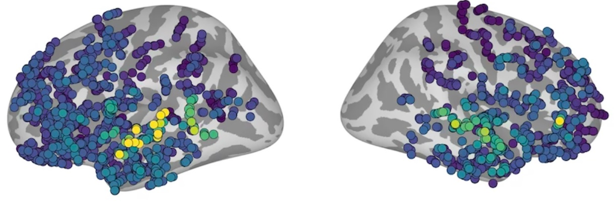

# Neuroprobe



Neuroprobe is a benchmark that reveals the relationship between tasks in the brain. It consists of 19 standardized decoding tasks derived from intracranial brain responses to naturalistic stimuli. The benchmark is based on the BrainTreebank dataset, which contains stereoelectroencephalography (SEEG) recordings from 10 patients watching Hollywood movies.

## Overview

Neuroprobe enables systematic evaluation of computational models on multimodal neural decoding tasks across:
- Visual features (brightness, motion flow, faces)
- Auditory features (volume, pitch) 
- Language features (speech detection, word properties)
- Multimodal features (speaker identification)

The benchmark includes defined train/test splits for assessing generalization:
| Train/Test Split | Description |
|-----------------|-------------|
| SS-SM | Same Subject - Same Movie |
| SS-DM | Same Subject - Different Movie | 
| DS-DM | Different Subject - Different Movie |

## Getting Started

Optionally, create a virtual environment:
```
python -m venv .venv
source .venv/bin/activate
pip install --upgrade pip
```

1. Install required packages:
```
pip install beautifulsoup4 requests torch torchvision h5py pandas scipy numpy matplotlib seaborn wandb scikit-learn psutil librosa
```

2. Specify the path to the braintreebank dataset (or the path to download it to) in the `btbench_config.py` file: 
```
ROOT_DIR = "braintreebank" # Root directory for the braintreebank data
```
Then, download and extract the braintreebank dataset (this step can be skipped if the dataset is already downloaded and extracted; it should be all extracted into the ROOT_DIR directory):
```
python braintreebank_download_extract.py
```

3. Process the subject trial dataframes:
```
python btbench_process_subject_trials.py
```
This command will create the files in a directory called `btbench_subject_metadata`.

4. Then, you use the file `quickstart.ipynb` to see how to create a dataset and evaluate a linear model.

5. To evaluate the linear regression model on all electrodes and time bins separately, run:
```
python single_electrode.py --subject SUBJECT_ID --trial TRIAL_ID --verbose
```
This command will create a JSON file in the `eval_results` directory with the results, according to the schema in `leaderboard_schema.json`. You can change the `save_dir` argument to save the results to a different directory: `--save_dir SAVE_DIR`.

## Citation

If you use Neuroprobe in your work, please cite the following paper:
TBD